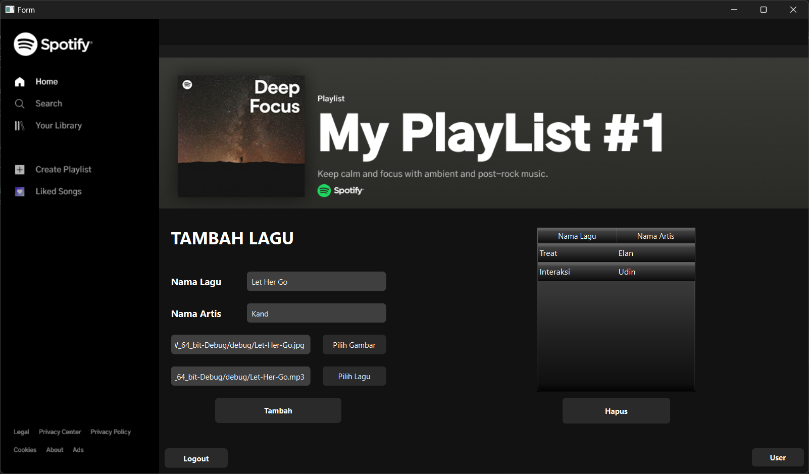

# 🎵 Spotify Sederhana

**Spotify Sederhana** adalah aplikasi desktop pemutar musik yang dikembangkan menggunakan **Qt 6 dan C++**. Aplikasi ini dirancang untuk meniru tampilan dan fungsi dasar dari Spotify, memberikan pengalaman mendengarkan musik secara lokal melalui antarmuka yang elegan dan mudah digunakan.

---

## 📦 Fitur Utama

- 🎧 Memutar file musik lokal
- 🎛️ Kontrol play/pause
- 🧾 Playlist sederhana
- 👥 Antarmuka pengguna dan admin
- 🖼️ Tampilan GUI yang didesain dengan Qt Designer
- 📦 Manajemen aset menggunakan Qt Resource (`resources.qrc`)

---

## 🛠️ Teknologi yang Digunakan

- **Qt 6** (GUI Framework)
- **C++**
- **Qt Designer (.ui)**
- **Qt Resource System (.qrc)**

---

## 🚀 Cara Menjalankan Aplikasi

### Prasyarat

- Qt 6 SDK (termasuk Qt Creator dan qmake)
- Compiler C++ (MinGW untuk Windows, GCC/Clang untuk Linux)

### Langkah-langkah

1. **Clone repositori ini**

```bash
git clone https://github.com/lann747/spotify-sederhana.git
cd spotify-sederhana
```

2. Buka proyek di Qt Creator:
- Buka file Spotify.pro menggunakan Qt Creator.

3. Build dan jalankan:
- Klik tombol "Run" di Qt Creator untuk membangun dan menjalankan aplikasi.

4. Login:
- Login menggunakan username: 'admin' & password: '123'

---

## 🗂️ Struktur Proyek
spotify-sederhana/
├── build/           
├── Frame 604.png                 
├── Frame 626.png                  
├── Frame 644.png                   
├── Spotify.pro                     
├── Spotify.pro.user               
├── admin.cpp                       
├── admin.h
├── admin.ui                        
├── home.png                        
├── logo.png                     
├── main.cpp                        
├── mainwindow.cpp                 
├── mainwindow.h
├── mainwindow.ui                  
├── play.png                      
├── playlist.png                 
├── playlist2.png                
├── resources.qrc               
├── user.cpp                       
├── user.h
├── user.ui                        
└── README.md  

---

## 📷 Cuplikan Layar




---

## 👤 Dibuat oleh
Lantera Meunasah (lann747)

